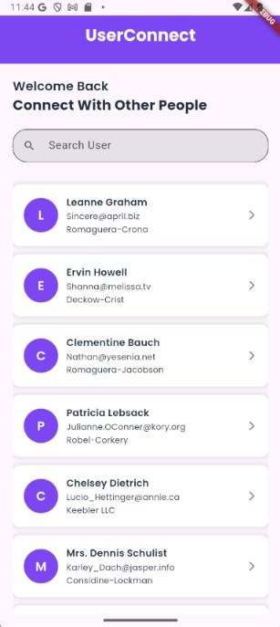
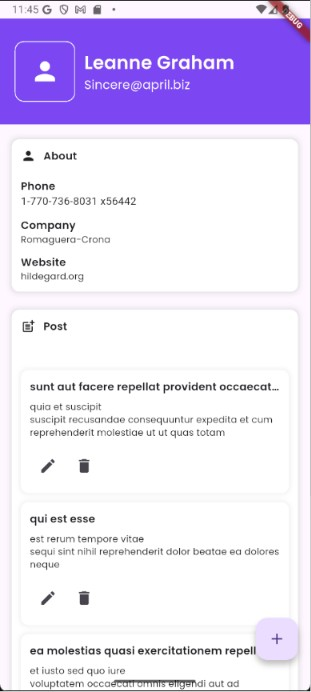
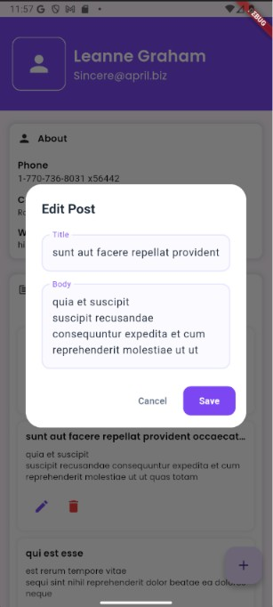
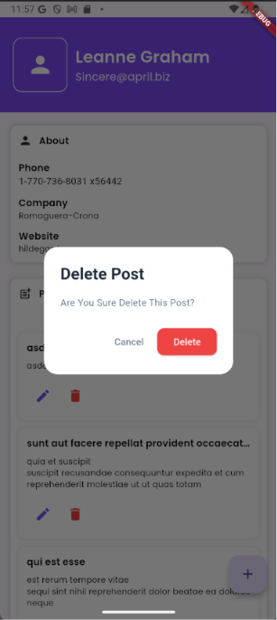

# userconnect

## State Management

Pada aplikasi ini saya menggunakan  StatefulWidget dan setState() sebagai state management.
Saya memilih setState() karena aplikasi yang dikembangkan masih memiliki state yang sederhana, 
seperti menampilkan data user, menambah postingan, mengubah postingan, dan menghapus postingan. 
Selain itu, setState() mudah dipahami, tidak memerlukan library tambahan, dan sudah cukup untuk 
mengelola perubahan data pada aplikasi ini. Dengan menggunakan setState(), setiap perubahan data 
dapat langsung memperbarui tampilan tanpa perlu melakukan refresh halaman secara manual.

## Alur Logika Aplikasi

1. Saat aplikasi dibuka, sistem mengambil data user dari API dan menampilkannya dalam bentuk daftar pengguna.
2. Pengguna dapat memilih salah satu user untuk melihat halaman detail. Pada halaman ini ditampilkan informasi user seperti nama, email, nomor telepon, perusahaan, dan website.
3. Setelah halaman detail dibuka, aplikasi mengambil data postingan berdasarkan ID user yang dipilih dan menampilkannya dalam bentuk daftar postingan.
4. Pengguna dapat menambahkan postingan baru melalui form. Data yang berhasil ditambahkan akan langsung muncul pada daftar postingan tanpa perlu memuat ulang halaman.
5. Pengguna juga dapat mengubah atau menghapus postingan yang ada. Setiap perubahan akan langsung diperbarui pada tampilan aplikasi agar data yang ditampilkan selalu sesuai dengan kondisi terbaru.
6. Selama proses pengambilan data, aplikasi menampilkan efek loading menggunakan Shimmer. Jika tidak ada data yang tersedia,    aplikasi akan menampilkan Empty State sebagai informasi kepada pengguna.

## Screenshots UI

## Users Page

## User Detail Page

## Create Post

## Update Post

## Delete Post

